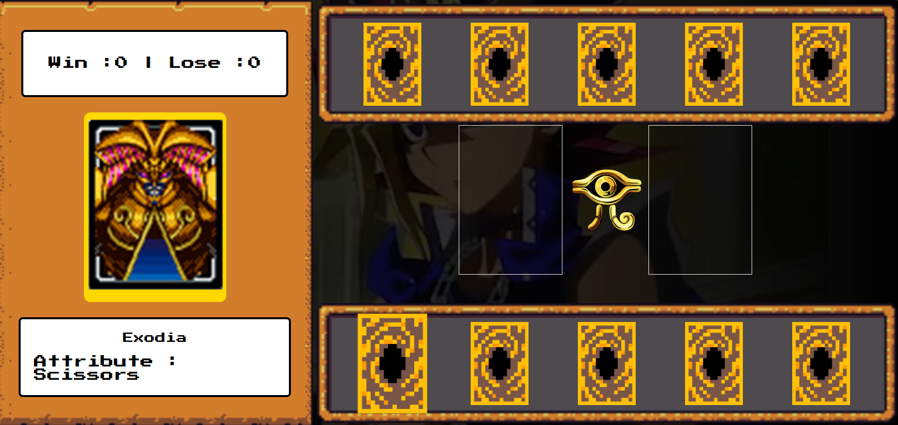

# 🃏 Yu-Gi-Oh! Jokenpô Edition

Projeto feito com HTML, CSS e JavaScript que traz o clássico jogo **Jokenpô (Pedra, Papel e Tesoura)** com a temática do universo **Yu-Gi-Oh!**. Escolha sua carta, desafie o computador para vencer com estilo!

---

## 💡 Funcionalidades

- 🎴 Cartas temáticas com **Dragão Branco de Olhos Azuis**, **Mago Negro** e **Exodia**  
- ⚔️ Sistema de duelo com lógica baseada em Jokenpô  
- 🎧 Efeitos sonoros para vitórias, derrotas   
- 🎥 Vídeo de fundo dinâmico com Yami Yugi  
- 🖱️ Cursor personalizado inspirado no anime  
- 🔁 Botão para reiniciar o duelo a qualquer momento  

---

## 📸 Preview

